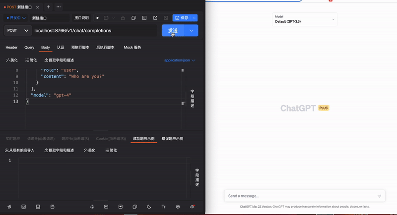

# Chatgpt API By Browser Script

[中文文档](./README.zh.md)

- This project runs on users' browsers through the Tampermonkey script and converts the web version of ChatGPT operations into an API interface.
- If you have a chatgpt plus account, you can use gpt-4.
- You can use this API to do some interesting things, such as playing [Auto-GPT](https://github.com/Significant-Gravitas/Auto-GPT).
- Not easy to be banned and easier to handle errors.



## Usage

### Step 1 Installation and Configuration

1. Make sure your system has installed Node.js and npm.
2. Clone this repository and run `npm install` in the project directory to install dependencies.
3. Run `npm run start` to start the Node.js server.
4. Alternatively, you can use Docker `docker-compose up` to start the Node.js server.

### Step 2 Use Tampermonkey

1. Install [Tampermonkey](https://www.tampermonkey.net/) browser extension.
2. Open Tampermonkey management panel and create a new script.
3. Copy the contents of `tampermonkey-script.js` file into the newly created script and save it.

### Step 3 Open and Log in to ChatGPT

[https://chat.openai.com/](https://chat.openai.com/)

### Step 4 Use API

Send a POST request to API address http://localhost:8766/v1/chat/completions

```json
{
  "messages": [
    {
      "role": "system",
      "content": "You are a helpful assistant."
    },
    {
      "role": "user",
      "content": "Who are you?"
    }
  ],
  "model": "gpt-4"
}

```

#### API Params
| Parameter   | Description                                      | Default | Required |
|-------------|--------------------------------------------------|---------|----------|
| messages    | Refer to OpenAI API documentation                |      | Yes      |
| model       | Refer to OpenAI API documentation                |      | No       |
| stream      | Refer to OpenAI API documentation                | false   | No       |
| newChat     | Whether to start a new conversation              | true    | No       |


## Expamle with Auto-GPT

Modify the llm_utils.py file in Auto-GPT.
```python
# response = openai.ChatCompletion.create(
#     model=model,
#     messages=messages,
#     temperature=temperature,
#     max_tokens=max_tokens,
# )
response = requests.post("http://localhost:8766/v1/chat/completions", json={"messages": messages, "model": model, "temperature": temperature, "max_tokens": max_tokens}).json()

# return response.choices[0].message["content"]
return response["choices"][0]["message"]["content"]
```
